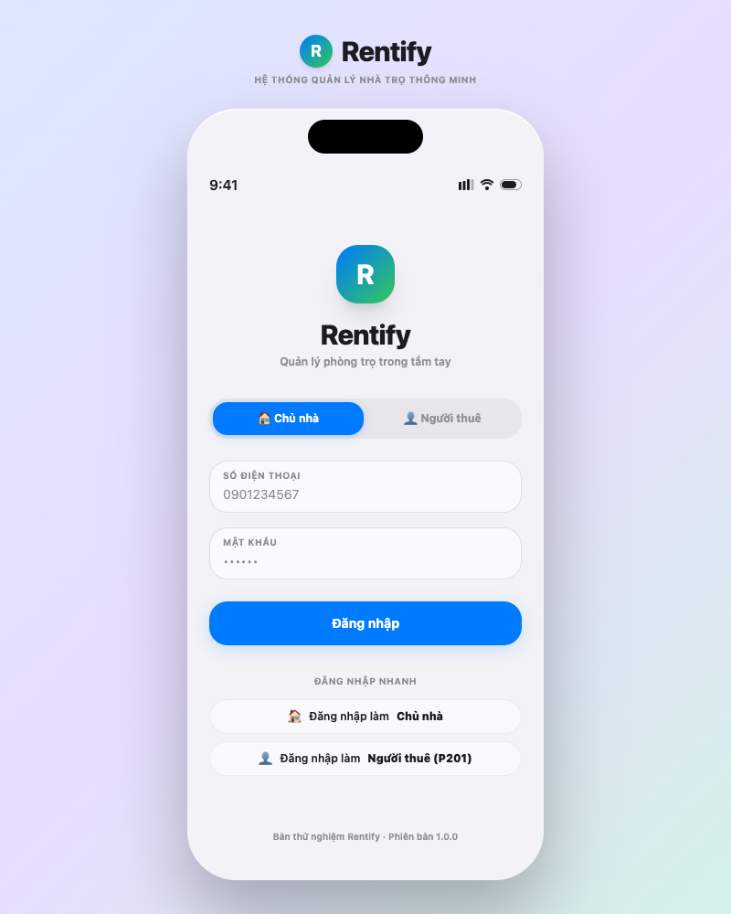
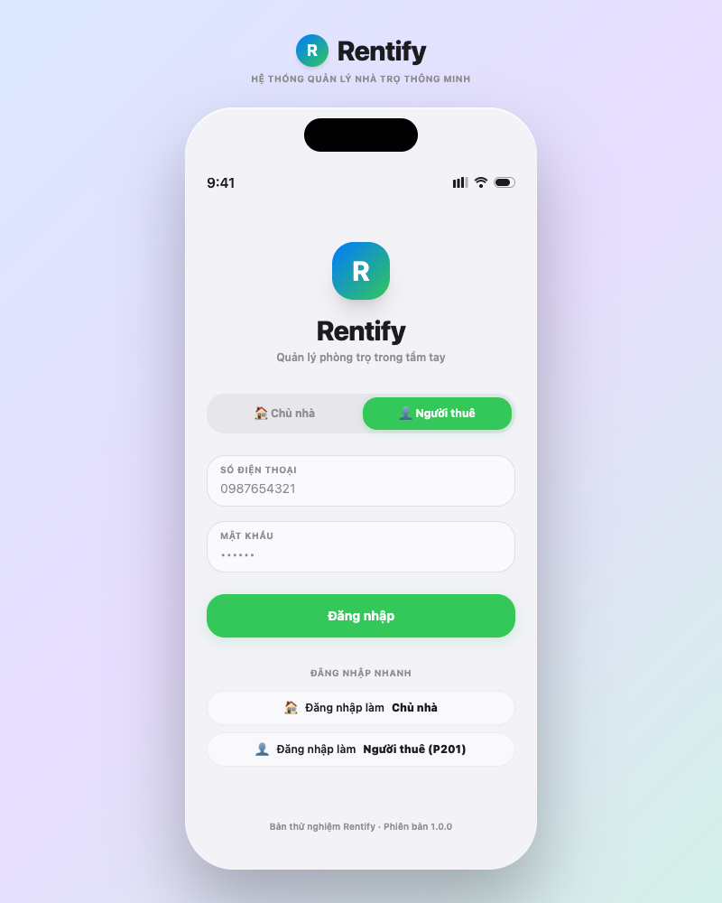
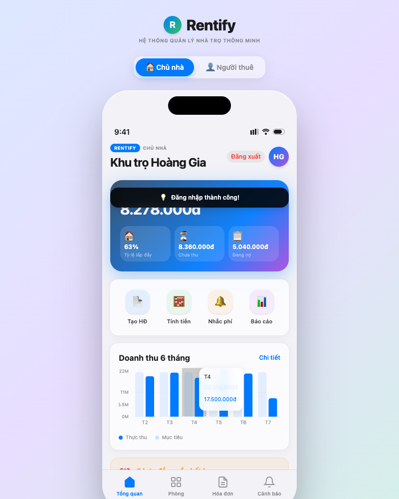
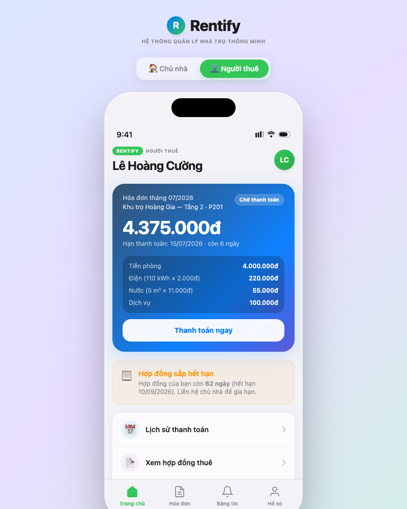
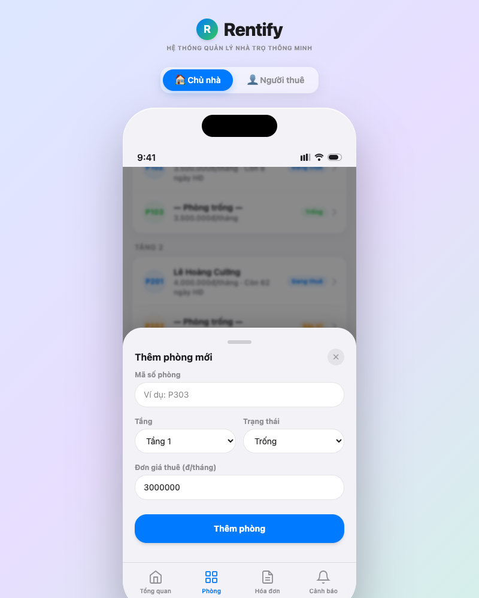
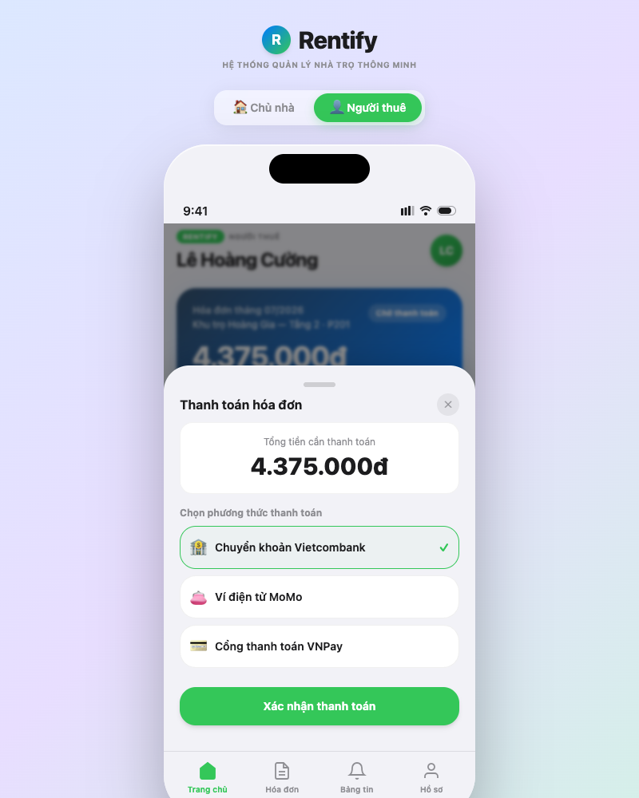
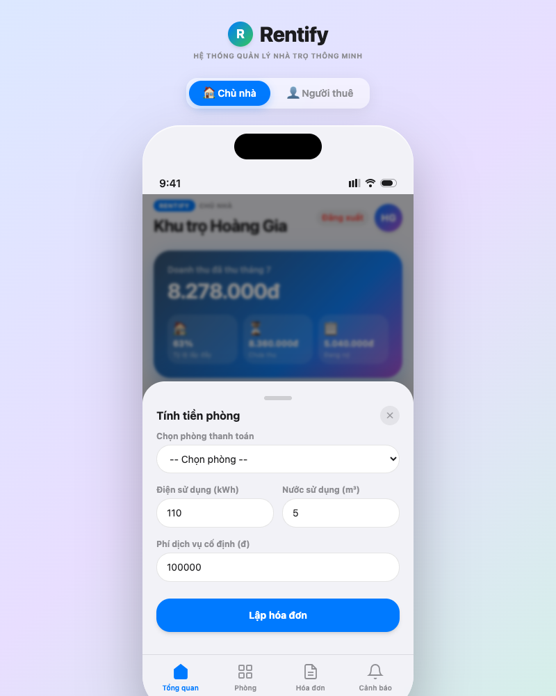

# Rentify — Smart Rental Management Prototype

Rentify is a smart rental management platform prototype built using the Apple iOS 26 UI Kit, designed to streamline landlord and tenant interactions.

## Features
- **Role Switching**: Login as either **Landlord** (Chủ nhà) or **Tenant** (Người thuê).
- **Interactive Forms**: Add new rooms, sign rental contracts, calculate utility bills, and send reminders.
- **Direct Broadcast Alerts**: Send urgent announcements from Landlord panel to Tenant notice bulletin boards.
- **Tenant Checkout Sync**: Simulates paying current bills and synchronizes instantly with the Landlord's income charts.

## Running the Code
1. Install dependencies:
   ```bash
   npm install
   ```
2. Start the local development server:
   ```bash
   npm run dev
   ```

## Production Deployment
The prototype is deployed live on Vercel: [https://rentify-prototype.vercel.app](https://rentify-prototype.vercel.app)

## Screenshots

| Functionality / View | Landlord Screen (Chủ nhà) | Tenant Screen (Người thuê) |
| :--- | :---: | :---: |
| **Login screen** |  |  |
| **Home Dashboard** |  |  |
| **Room Creation / Checkout** |  <br> *(Add New Room)* |  <br> *(Payment Checkout)* |
| **Billing & Calculators** |  <br> *(Utility Calculator)* | — |
| **Batch Reminders** |  <br> *(Checkbox Multi-select)* | — |